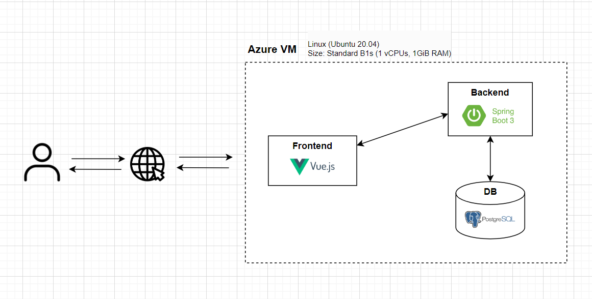
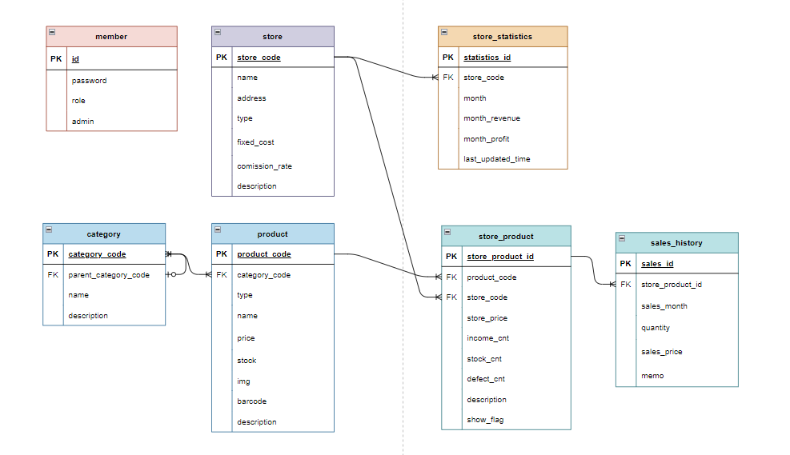

# logistics

> 제품 재고 및 수익 관리를 위한 시스템

## About Project

### 프로젝트 목표

- 아이디어스, 네이버 스토어 등 다양한 매장에서 판매되는 제품들의 재고와 수익을 관리하고, 통계를 통해 확인하기 위해 개발되었습니다. 기존에 수동으로 제품 및 재료 관리를 하던 과정에서 발생했던 누락이나 오류를 줄이고자 자동화하는 것이 주 목표입니다.
- 팀원 중 한 명의 가족이 엑셀을 이용한 제품 및 재고 관리 중 겪었던 어려움에서 영감을 받았습니다. 제품 판매 및 재고 추적을 자동화하여 더 정확하고 신뢰할 수 있는 방법을 제공함으로써 관리 과정의 효율성과 오류 없는 운영을 보장합니다.

### 아키텍처 설계도



### ERD



### Role Distribution

| Name   | Role     | Github Link                  |
| ------ | -------- | ---------------------------- |
| 최예희 | Backend  | https://github.com/ZinnaChoi |
| 류예종 | Frontend | https://github.com/JoshRyu   |

# How to start

## Database Setup

```
cd database
docker-compose up -d
```

## Frontend Setup

- Node Version: v18.12.0

  - nvm 사용시 아래 명령어로 버전 변경 가능

  ```cmd
    nvm install 18.12.0
    nvm use 18.12.0
  ```

- Frontend 설치 및 실행

```cmd
cd frontend
npm i
npm run dev
```

## Backend Setup

- Java Version: v17
- 실행

```sh
cd backend
./mvnw spring-boot:run
```

## Swagger URL

> http://localhost:11101/swagger-ui/index.html

## Deploy

### Jar Build

```sh
sh package.sh
```

### Execute Jar

```cmd
java -jar ./backend/target/{jarFileName}.jar
```
